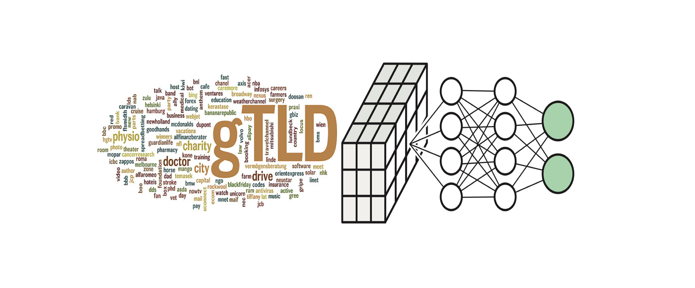

# Domain detection Initiative

We continuously analyze the zone files of several top level domains to identify malicious domains weeks before they are reported on any other blacklist.

## Domain detection feed: 
The feed is
<snippet>
copy/paste recent segment of the feed
</snippet>

## How to use the feed? 
The feed is to be used at the user’s discretion; it can be used for any activity ranging from ML experimentation, threat hunting, or live detection. We encourage users to check whether the correlation of the feed with the network traffic logs of their organization results in matches missed by existing defenses. It has systematically been the case for us and we would love to hear other success (or failure) stories! 

## Initial stats of the feed: 
As of the day of the writing this post (2018-10-XX) (XX weeks after initializing the system), the feed contains XX blacklisted domains, and YY suspected malicious domains (domains identified by the system that are not blacklisted as of the day of this writing). 

## References
Results of a comparative analysis will be presented at IEEE BigData conference in December 2018 (http://cci.drexel.edu/bigdata/bigdata2018/). 

## Call to action: 
We look forward to expanding the feed by either expanding both the data sources analyzed on a daily basis, or the “domain families” detected with the ML models. Either way, if you would like to contribute to this project by providing malicious domains that are not included in the list please do get in touch!  
